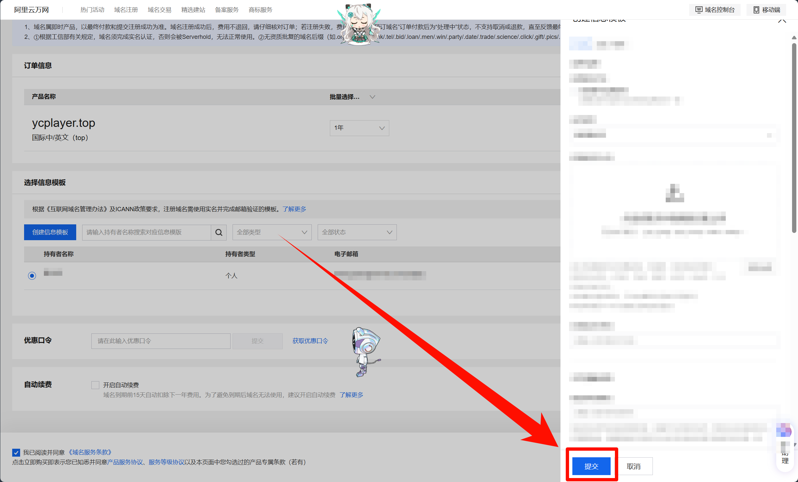

# 💫 在阿里云上注册域名

## 🔶 教程概述

> 本教程介绍如何在阿里云上的注册和购买域名。
>
> 最终实现以下效果：
>
> 
>
> 打开`阿里云控制台`，能够看见自己的账号拥有了有一个域名

---

## 🔶 阿里云简介

> [*阿里云*](https://www.aliyun.com/)成立于2009年，是全球领先的**云计算及人工智能科技公司**，致力于提供安全、可靠的计算和数据处理能力。
>
> **官网👉 [🌐https://www.aliyun.com/](https://www.aliyun.com/)**
>
> **关于👉 [🌐https://www.aliyun.com/about](https://www.aliyun.com/about)**

---

## 🔶 准备工作

### 准备好一个阿里云账号

👉 [>>> 阿里云账号注册 <<<](https://account.aliyun.com/register/qr_register.htm) 👈

---

## 🔶 具体步骤

### 登录阿里云

👉 [>>> 阿里云登录 <<<](https://account.aliyun.com/login/login.htm) 👈

### 点击搜索框

### 输入`域名`两字

### 点击下面的`域名注册`

### 来到域名注册页面，点击搜索框

👉 [>>> 域名注册页面 <<<](https://wanwang.aliyun.com/domain) 👈

### 填写你想要的域名

### 点击`查询`或直接回车

### 来到查找结果页面，找到你要的域名(这里作者推荐`.top`域名)，点击`立即注册`

### 来到结账页面，选择持续租借时间

### 选择信息模板

> ## 如果没有信息模板解决方案
>
> ### 点击`创建信息模板`
>
> 
>
> ### 然后填写信息模板
>
> 
>
> ### 填写完信息模板后，点击`提交`
>
> 

### 点击`立即购买`

### 完成上述步骤后，来到付款页面，点击`支付`

---

## 🔶 验证

👉 [>>> 点击这里就能查看 <<<](https://dc.console.aliyun.com/next/index#/overview) 👈

