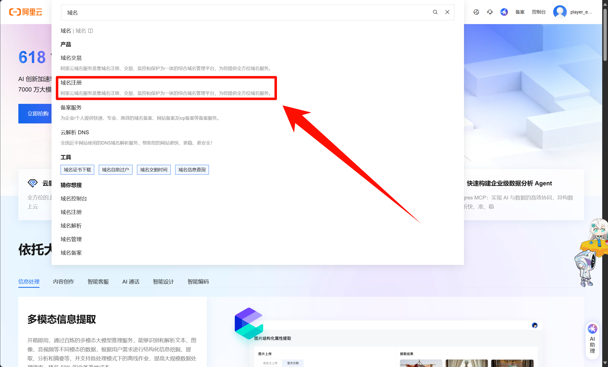
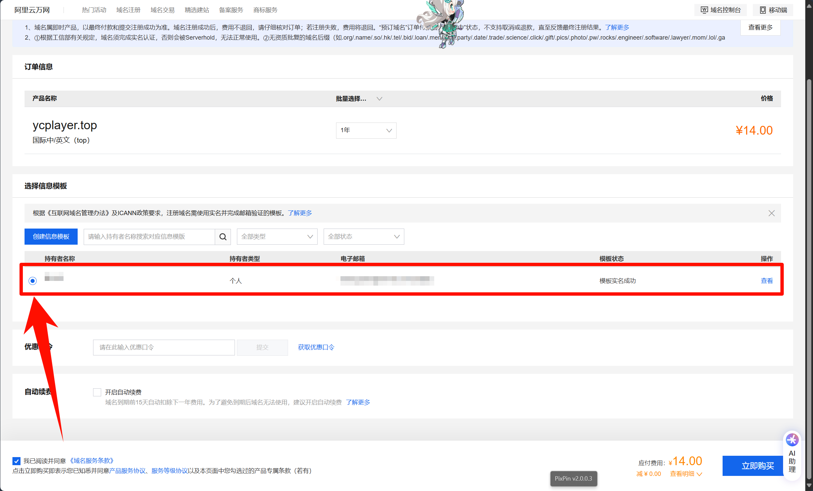
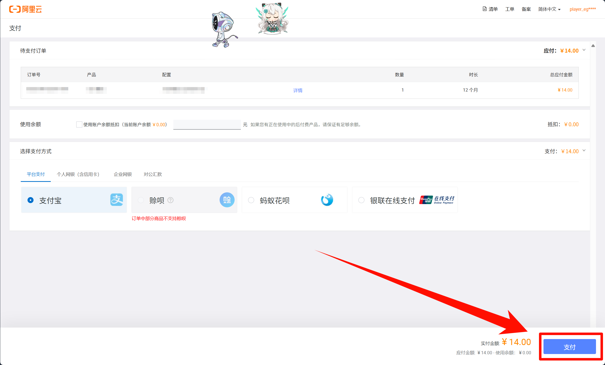
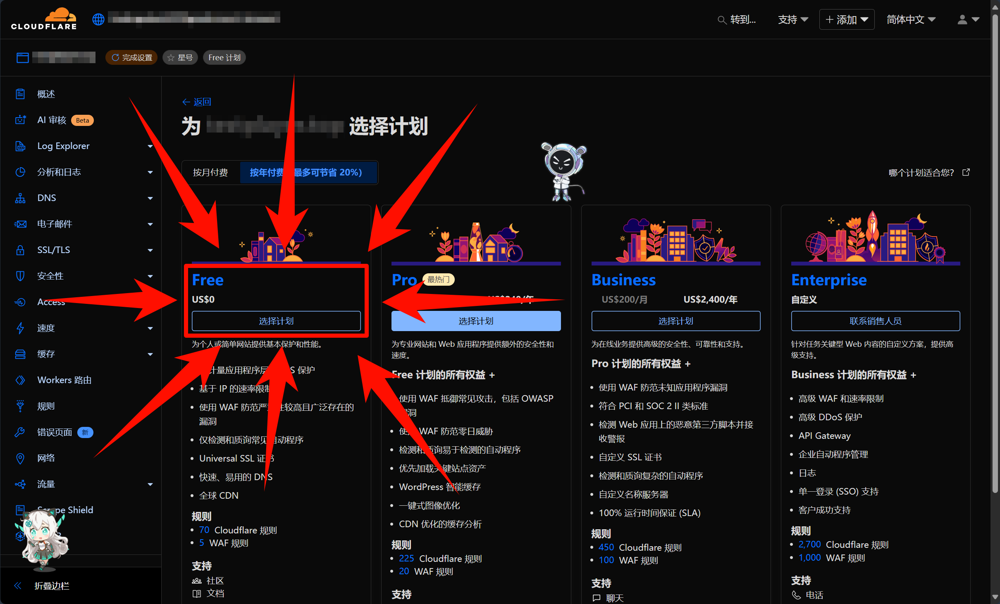
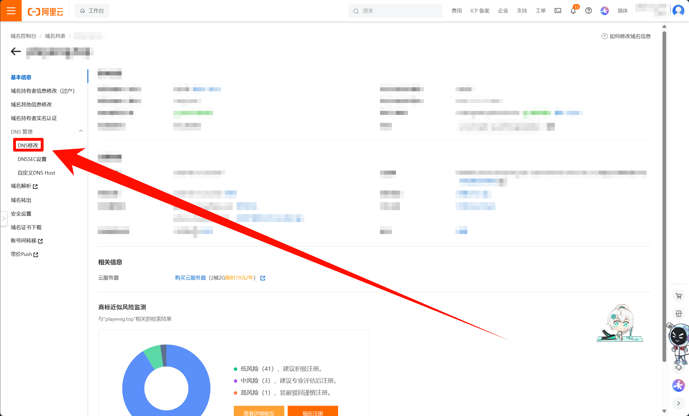
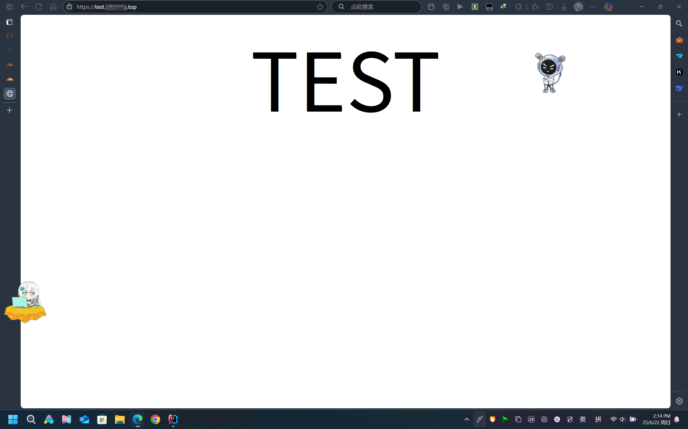
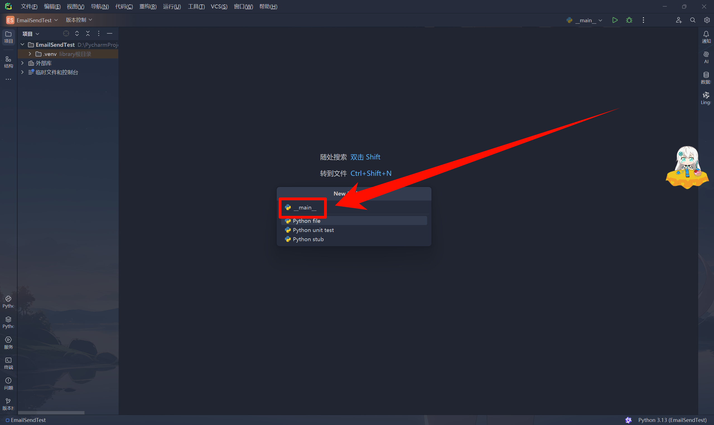

# 使用ResendAPI实现基础的邮箱发送

> **注意**：
> 本教程将会使用到Google和github等国外服务（因为相对来说更加方便），
> 如果你的网络环境不支持直接连接外域，
> 请使用VPN或者代理

## 教程概述

> 本教程介绍如何使用ResendAPI实现基础的邮箱发送。
> 将使用Python3作为编程语言，使用ResendAPI实现基础的邮箱发送。
>
> 最终实现以下效果：
> 
> 通过[`random`](https://docs.python.org/zh-cn/3/library/random.html)模块生成随机数，将随机数作为邮件内容发送给指定邮箱。
> 并判断用户输入的数字是否正确。

## ResendAPI简介

> ResendAPI是一个用于发送邮件的API，可以免费使用。
>
> 官网：<https://resend.com/>
>
> 官方文档：<https://resend.com/docs/api>

## 准备工作

1. 安装[Python3](https://www.python.org/downloads/)环境，作为本次教程的主要编程语言 | [具体教程](foundation/002-Python环境安装.md)
2. 安装[PyCharm](https://www.jetbrains.com/zh-cn/pycharm/)环境，作为本次教程的编辑器 | [具体教程](foundation/001-JetBrains全家桶安装激活.md)
3. 注册账号：
   - [阿里云](https://www.aliyun.com/)账号
   - [cloudflare](https://www.cloudflare.com/)账号
   - [resend](https://resend.com/)账号

## 具体步骤

### 一、购买阿里云上的域名

#### 1. [登录阿里云](https://account.aliyun.com/login/login.htm)


#### 2. 点击搜索框输入`域名`两字


#### 3. 点击下面的`域名注册`



#### 4. 来到[域名注册页面](https://wanwang.aliyun.com/domain)，填写你想要的域名，点击`查询`或直接回车


#### 5. 来到查找结果页面，找到你要的域名(这里作者推荐`.top`域名)，点击`立即注册`


#### 6. 来到结账页面，选择持续租借时间，选择信息模板，点击`立即购买`





> ##### 如果没有信息模板解决方案
>
> 点击`创建信息模板`
> 
> 然后填写信息模板
> 
> 填写完信息模板后，点击`提交`
> 

#### 7. 完成上述步骤后，来到付款页面，点击`支付`



#### 8.都看到这里了，恭喜你，已经成功拥有了你自己的域名，[点击这里就能查看](https://dc.console.aliyun.com/next/index#/overview)


### 二、配置域名DNS解析

#### 1.[登录cloudflare](https://dash.cloudflare.com/login)


#### 2. 登陆成功，来到控制台，点击`+ 添加`，再点击`连接域`


#### 3. 在`输入现有域`下面的输入框中输入你的域名，然后点击`继续`


#### 4. 将会让你选择计划，个人建议选择使用免费计划，如果条件允许可以选择付费计划



#### 5. 接下来是配置DNS解析

> - 首先等待域名解析完成，任何直接点击`继续`
>   
> - 接下来更改域名的DNS解析
> - 复制这个页面提供的两个`Cloudflare名称服务器`的地址
>   
> - 来到你的[阿里云控制台](https://dc.console.aliyun.com/next/index),点击全部域名
>   
> - 来到域名列表，找到你刚刚购买的域名，点击`管理`
>   
> - 来到域名详情页，点击`DNS修改`
>   
> - 点击`修改DNS服务器`
>   
> - 将刚刚Cloudflare提供的两个`Cloudflare名称服务器`的地址，复制到对应框中（①对①，②对②）
>   - 复制：
>     
>   - 粘贴：
>     
> - 点击`确定`
>   
> - 进行一下验证
>   
>   
> - 成功后会跳转回域名`DNS修改`页面，如果NDS服务器变成了`xxx.cloudflare.com`，则表示成功
>   

#### 6. 现在我们测试一下是否配置成功

> - 来到[cloudflare的控制台](https://dash.cloudflare.com/)，点击`Workers和Pages`
>   
> - 在Workers和Pages页面点击`创建`
>   
> - 来到Workers和Pages创建页面，选择`Pages`
>   
> - 点击使用直接上传的`开始使用`
>   
> - 来到创建页面，填入项目名称
>   
> - 接着点击`创建项目`
>   
> - 复制以下HTML代码复制到`test\index.html`中
>   
>
>   ```html
>   <!-- index.html -->
>   <!DOCTYPE html>
>   <html lang="en">
>   <head>
>    <meta charset="UTF-8" />
>    <meta name="viewport" content="width=device-width, initial-scale=1.0" />
>    <title>TEST</title>
>   </head>
>   <body>
>    <div
>      style="
>        display: flex;
>        justify-content: center;
>        align-items: center;
>        font-size: 200px;
>      "
>    >
>      TEST
>    </div>
>   </body>
>   </html>
>   ```
>
> - 将test文件夹上传并部署
>   
>   
> - 点击`添加自定义域`
>   
> - 点击`设置自定义域`
>   
> - 填入你的域名的子域`test.你的域名`
>   
> - 点击`继续`
>   
> - 来到激活域的页面，点击`激活域`
>   
> - 接下来打开你喜爱的游戏，等待子域被激活
>   
> - 子域激活成功后，用浏览器打开子域地址
>   
> - 如果看到这个页面说明部署成功
>   

### 三、配置resend邮箱路由

#### 1. [登录Resend](https://resend.com/)


#### 2. 点击`Domains`，来到[Domains页面](https://resend.com/domains)


#### 3. 点击`Add Domain`，来到[Add Domain页面](https://resend.com/domains/add)


#### 5. 填写信息，完成添加域名

> - 填入用于邮箱发送的子域，地区推荐选择US
>   
> - 点击`Add Domain`
>   
> - 来到DNS配置页面，直接点击`登录到Cloudflare`
>   
> - 弹出Cloudflare授权窗口，点击`授权`
>   
> - 现在又可以打开你喜欢的游戏，等待激活成功了。当显示```Well done! All the DNS records are verified. You are ready to start building and sending emails with this domain.```说明激活成功了
>   

#### 4. 点击`API keys`，来到[API Keys页面](https://resend.com/api-keys)


#### 5. 点击`Create API key`，创建API key


#### 6. 最后复制保存ResendAPIkey


### 四、开始发送你的第一个resend邮件

#### 1. 打开PyCharm新建项目

> - 点击`新建项目`
>   
> - 项目命名为`EmailSendTest`
>   
> - 点击`创建`
>   

#### 2. 来到项目，按照以下顺序点击创建文件


#### 3. 分别创建`__main__.py`和`resend_email_demo.py`文件




#### 4. 根据[ResendAPI文档](https://resend.com/docs/api-reference/emails/send-email)，编写`resend_email_demo.py`工具文件

```python
# 官方API
import resend
resend.api_key = "re_xxxxxxxxx"
params: resend.Emails.SendParams = {
  "from": "Acme <onboarding@resend.dev>",
  "to": ["delivered@resend.dev"],
  "subject": "hello world",
  "html": "<p>it works!</p>"
}
email = resend.Emails.send(params)
print(email)
```

```python
# resend_email_demo.py
import resend
def sendEmail(
        __fromName__,   # 发送人昵称
        __fromEmail__,  # 发送人邮箱
        __to__,         # 收件人邮箱
        __subject__,    # 标题
        __html__        # 内容
):
    # 获取api授权（填写自己的ResendAPIkey）
    resend.api_key = "re_XXXXXXXXXXXXXXXXXXXXXXXXXXXXXXXXXX"
    # 发送邮件参数-from、to、subject、html
    params: resend.Emails.SendParams = {
        "from": f'{__fromName__} <{__fromEmail__}>',
        "to": __to__,
        "subject": __subject__,
        "html": __html__
    }
    email = resend.Emails.send(params)
    print(email) # 打印ID
```

#### 5.完善`__main__.py`文件

```python
# __main__.py
import resend_email_demo
import random

if __name__ == '__main__':
    # 生成一个随机值
    rand_num = random.randint(1, 100)
    # 发送邮件
    resend_email_demo.sendEmail(
        "Acme",  # 邮件发送者昵称
        "onboarding@resend.dev",  # 邮件发送者邮箱
        input('接收者：'),  # 邮件接收者邮箱
        "我是标题",  # 邮件标题
        f'这个是你的幸运数字 ヾ(^▽^*))) ：{rand_num}'
    )
    if int(input('你的收到的数字是：')) == rand_num:
        print('对的！没错！')
    else:
        print('好像不是的呢！')
```

#### 6.点击运行


