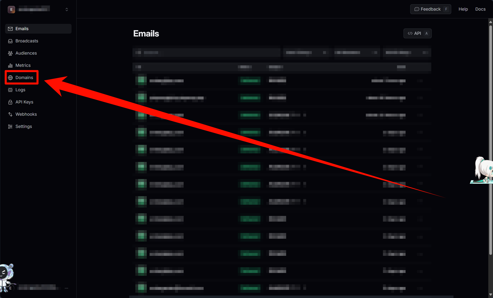
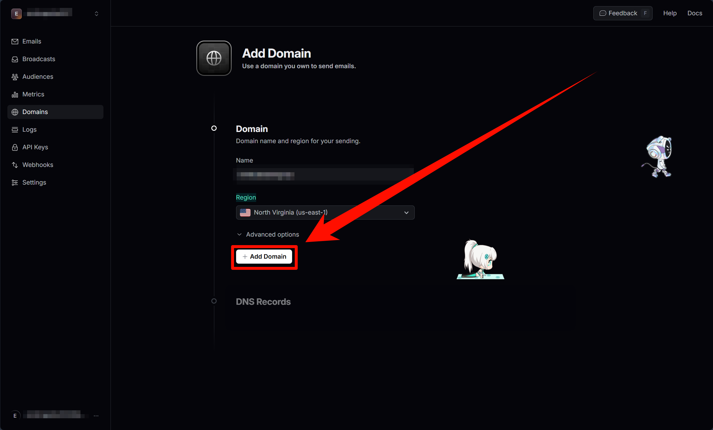

# 使用ResendAPI实现基础的邮箱发送

> **注意**：
> 本教程将会使用到Google和github等国外服务（因为相对来说更加方便），
> 如果你的网络环境不支持直接连接外域，
> 请使用VPN或者代理

## 教程概述

> 本教程介绍如何使用ResendAPI实现基础的邮箱发送。将使用Python3作为编程语言，使用ResendAPI实现基础的邮箱发送。
>
> 最终实现以下效果：
>
> 
>
> 通过[`random`](https://docs.python.org/zh-cn/3/library/random.html)模块生成随机数，将随机数作为邮件内容发送给指定邮箱。并判断用户输入的数字是否正确。

## ResendAPI简介

> ResendAPI是一个用于发送邮件的API，可以免费使用。
>
> 官网：<https://resend.com/>
>
> 官方文档：<https://resend.com/docs/api>

## 准备工作

### 安装[Python3](https://www.python.org/downloads/)环境，作为本次教程的主要编程语言

- [>>> 具体教程 <<<](foundation/002-Python环境安装.md)

### 安装[PyCharm](https://www.jetbrains.com/zh-cn/pycharm/)环境，作为本次教程的编辑器

- [>>> 具体教程 <<<](foundation/001-JetBrains全家桶安装激活.md)

### 注册一个[阿里云](https://cn.aliyun.com/)域名

- [>>> 具体教程 <<<](001%20-%20在阿里云上注册域名.md)

### 将域名DNS解析配置为[Cloudflare](https://www.cloudflare-cn.com/enterprise/)

- [>>> 具体教程 <<<](002%20-%20将阿里云域名DNS解析改为Cloudflare第三方DNS解析.md)

### 准备好一个[Resend](https://resend.com/)账号

- [>>> Resend账号注册 <<<](https://resend.com/signup)

## 具体步骤

### 登录Resend[](https://resend.com/)


### 点击`Domains`，来到[Domains页面](https://resend.com/domains)



### 点击`Add Domain`，来到[Add Domain页面](https://resend.com/domains/add)


### 填写信息，完成添加域名

> - 填入用于邮箱发送的子域，地区推荐选择US
>
> 
>
> - 点击`Add Domain`
>
> 
>
> - 来到DNS配置页面，直接点击`登录到Cloudflare`
>
> 
>
> - 弹出Cloudflare授权窗口，点击`授权`
>
> 
>
> - 现在可以打开你喜欢的游戏，等待激活成功了。当显示：
>
> ```Well done! All the DNS records are verified. You are ready to start building and sending emails with this domain.```
>
> 说明激活成功了
>
> 

### 4. 点击`API keys`，来到[API Keys页面](https://resend.com/api-keys)


### 5. 现在创建API key

> - 点击`Create API key`
>
> 
>
> - 填写API key名称和权限
>
> 
>
> - 点击`Add`
>
> 

### 6. 最后复制保存ResendAPIkey


## 开始发送你的第一个resend邮件

### 打开PyCharm新建项目

> - 点击`新建项目`
>
> 
>
> - 项目命名为`EmailSendTest`
>
> 
>
> - 点击`创建`
>
> 

### 来到项目，按照以下顺序点击创建文件


### 分别创建`__main__.py`和`resend_email_demo.py`文件

> - 创建`__main__.py`
>
> 
>
> - 创建`resend_email_demo.py`
>
> 

### 根据ResendAPI文档，编写工具方法

- [>>> ResendAPI文档 <<<](https://resend.com/docs/api-reference/emails/send-email)

```python
# 官方API
import resend

resend.api_key = "re_xxxxxxxxx"
params: resend.Emails.SendParams = {
    "from": "Acme <onboarding@resend.dev>",
    "to": ["delivered@resend.dev"],
    "subject": "hello world",
    "html": "<p>it works!</p>"
}
email = resend.Emails.send(params)
print(email)
```

### 完善`resend_email_demo.py`文件

```python
# resend_email_demo.py
import resend


def sendEmail(
        __fromName__,  # 发送人昵称
        __fromEmail__,  # 发送人邮箱
        __to__,  # 收件人邮箱
        __subject__,  # 标题
        __html__  # 内容
):
    # 获取api授权（填写自己的ResendAPIkey）
    resend.api_key = "re_XXXXXXXXXXXXXXXXXXXXXXXXXXXXXXXXXX"
    # 发送邮件参数-from、to、subject、html
    params: resend.Emails.SendParams = {
        "from": f'{__fromName__} <{__fromEmail__}>',
        "to": __to__,
        "subject": __subject__,
        "html": __html__
    }
    email = resend.Emails.send(params)
    print(email)  # 打印ID
```

### 完善`__main__.py`文件

```python
# __main__.py
import resend_email_demo
import random

if __name__ == '__main__':
    # 生成一个随机值
    rand_num = random.randint(1, 100)
    # 发送邮件
    resend_email_demo.sendEmail(
        "Acme",  # 邮件发送者昵称
        "onboarding@resend.dev",  # 邮件发送者邮箱
        input('接收者：'),  # 邮件接收者邮箱
        "我是标题",  # 邮件标题
        f'这个是你的幸运数字 ヾ(^▽^*))) ：{rand_num}'
    )
    if int(input('你的收到的数字是：')) == rand_num:
        print('对的！没错！')
    else:
        print('好像不是的呢！')
```

## 验证

### 运行`__main__.py`文件，效果如下


