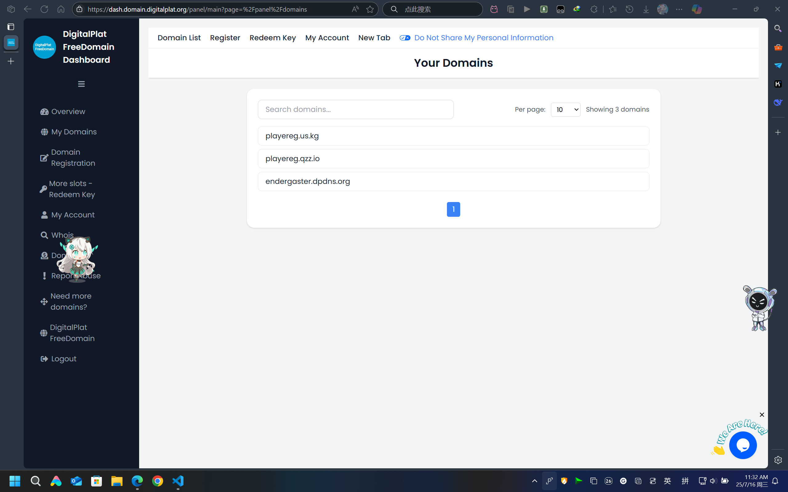

# 💫 注册DigitalPlat免费美国域名

> ⚠️**注意**：本教程将会使用到Google和github等国外服务（因为相对来说更加方便），如果你的网络环境不支持直接连接外域，请使用VPN或者代理

---

## 🔶 教程概述

> 本教程介绍如何使用DigitalPlat免费注册美国域名。
>
> 最终实现以下效果：
>
> 
>
> 打开[DigitalPlat控制台](https://dash.domain.digitalplat.org/panel/main)，在My Domains页面可以看到自己注册的域名。

---

## 🔶 DigitalPlat简介

> [*DigitalPlat*](https://digitalplat.org/)是一个**全球性的非营利组织**，致力于通过开源计划推动创新、包容性和协作。
>
> **官网👉 [🌐https://digitalplat.org/](https://digitalplat.org/)**
>
> **关于👉 [🌐https://digitalplat.org/about/](https://digitalplat.org/about/)**

---

## 🔶 准备工作

### 一个Github账号

<iframe src="//player.bilibili.com/player.html?isOutside=true&aid=1652838105&bvid=BV1eE421M7Wr&cid=1499033383&p=1" scrolling="no" border="0" frameborder="no" framespacing="0" allowfullscreen="true"></iframe>

### 一个可用的邮箱账号

### 