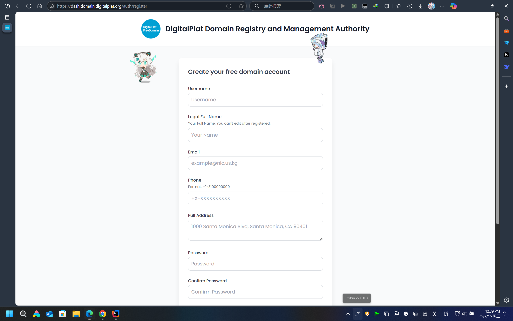

# 💫 注册DigitalPlat免费美国域名

> ⚠️**注意**：本教程将会使用到Google和github等国外服务（因为相对来说更加方便），如果你的网络环境不支持直接连接外域，请使用VPN或者代理

---

## 🔶 教程概述

> 本教程介绍如何使用DigitalPlat免费注册美国域名。
>
> 最终实现以下效果：
>
> 
>
> 打开[DigitalPlat控制台](https://dash.domain.digitalplat.org/panel/main)，在My Domains页面可以看到自己注册的域名。

---

## 🔶 DigitalPlat简介

> [*DigitalPlat*](https://digitalplat.org/)是一个**全球性的非营利组织**，致力于通过开源计划推动创新、包容性和协作。
>
> **官网👉 [🌐https://digitalplat.org/](https://digitalplat.org/)**
>
> **关于👉 [🌐https://digitalplat.org/about/](https://digitalplat.org/about/)**

---

## 🔶 准备工作

### 一个Github账号

 👉 [>>> GitHub官网 <<<](https://github.com/) 👈

👉 [>>> 具体教程 <<<](https://www.bilibili.com/video/BV1eE421M7Wr/?share_source=copy_web&vd_source=240160cbd7928481ec388b93ea9835a2) 👈

### 一个可用的邮箱账号

| 序号 | 邮箱供应商 | 官网                                                   |
|:--:|------:|:-----------------------------------------------------|
| 1  |   163 | [https://mail.163.com/](https://mail.163.com/)       |
| 2  |    QQ | [https://mail.qq.com/](https://mail.qq.com/)         |
| 3  |   126 | [https://mail.126.com/](https://mail.126.com/)       |
| 4  |   139 | [https://mail.10086.cn/](https://mail.10086.cn/)     |
| 5  | gmail | [https://mail.google.com/](https://mail.google.com/) |

---

## 🔶 具体步骤

### 进入DigitalPlat注册页面

👉 [>>> DigitalPlat注册页面 <<<](https://dash.domain.digitalplat.org/auth/register) 👈

