# 💫 JetBrains全家桶安装激活

## 🔷 教程概述

> 本教程将教学JetBrains全家桶安装加激活，在后续教程作为工具使用。
>
> 最终实现以下效果：
>
> 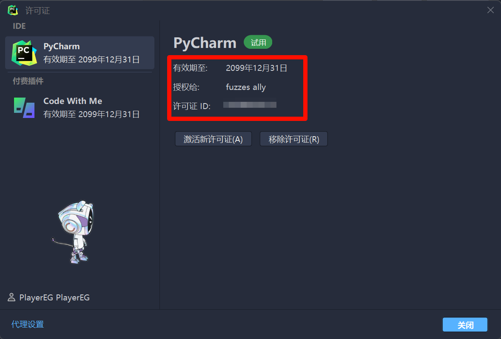
>
> JetBrainsIDE被激活到2099年12月31日

---

## 🔷 JetBrains全家桶简介

> JetBrains全家桶是由*JetBrains公司*提供的一套集成开发环境(IDE)和开发工具包，包括**IntelliJ IDEA、PyCharm、Rider、CLion、Goland、PhpStorm、WebStorm**等。

---

## 🔷 准备工作

### 准备安装包(这里以PyCharm举例)

> - 首先在浏览器上输入搜索`<对应的JetBrainsIDE名称> other version`
>
> 👉 [>>> 搜索模板 <<<](https://cn.bing.com/search?q=<这里输入JetBrainsIDE名称>+other+version) 👈
>
> 
>
> - 在搜索结果中找到`Other Versions - <对应的JetBrainsIDE名称> - JetBrains`，点进去
>
> 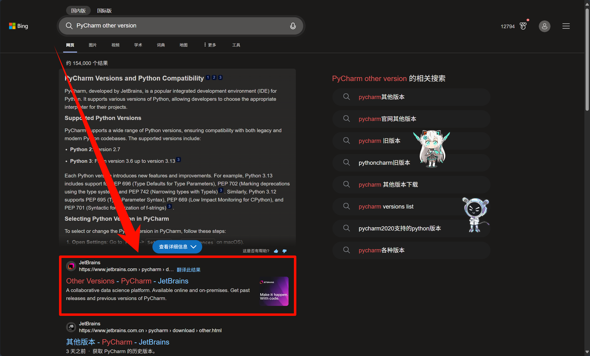
>
> - 来到`Other Versions`页面，向下翻页，找到`Version 2024.1 - 2024.3`的区域(推荐使用这个版本区间，容易被本教程提供的脚本激活)
>
> 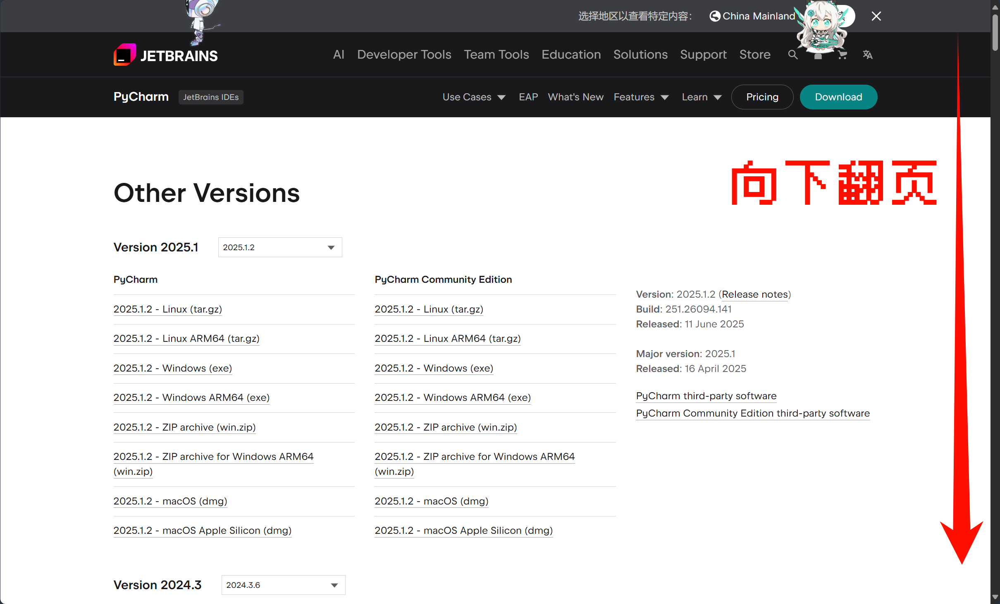
>
> 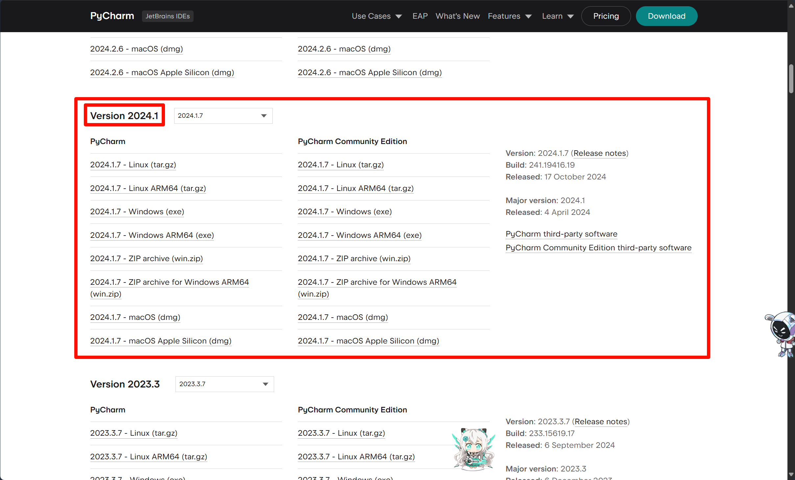
>
> - 找到对应的IDE专业版的`Windows (exe)`安装包，点击下载
>
> 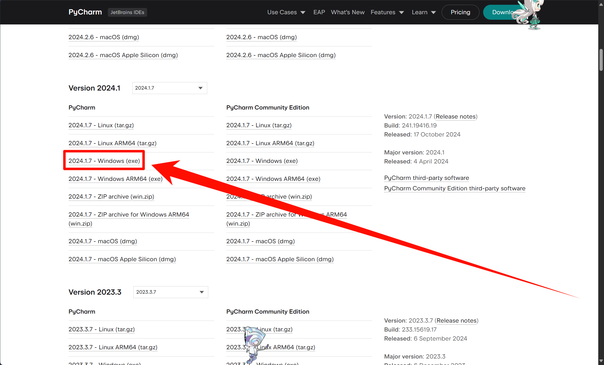
>
> 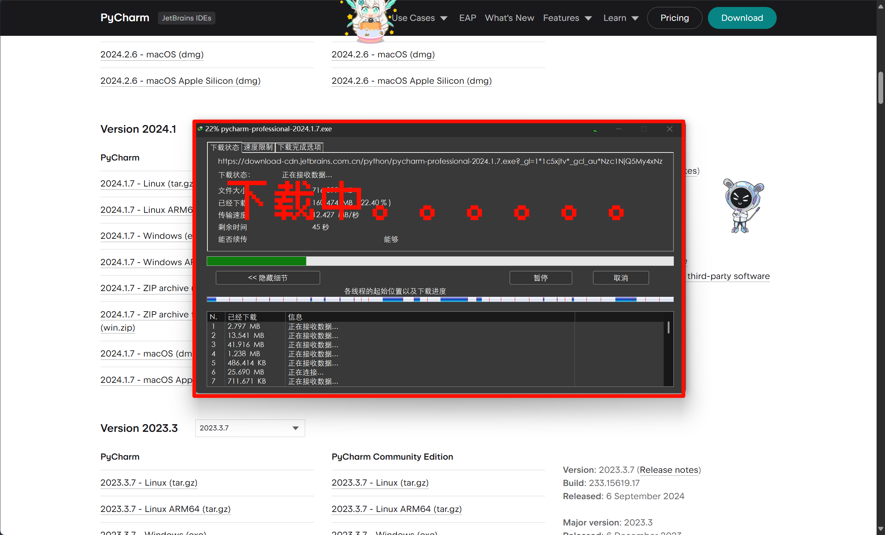
>
> - 来到你电脑的`下载`目录，找到对应的IDE安装包，将它移动到桌面，用于后续步骤
>
> 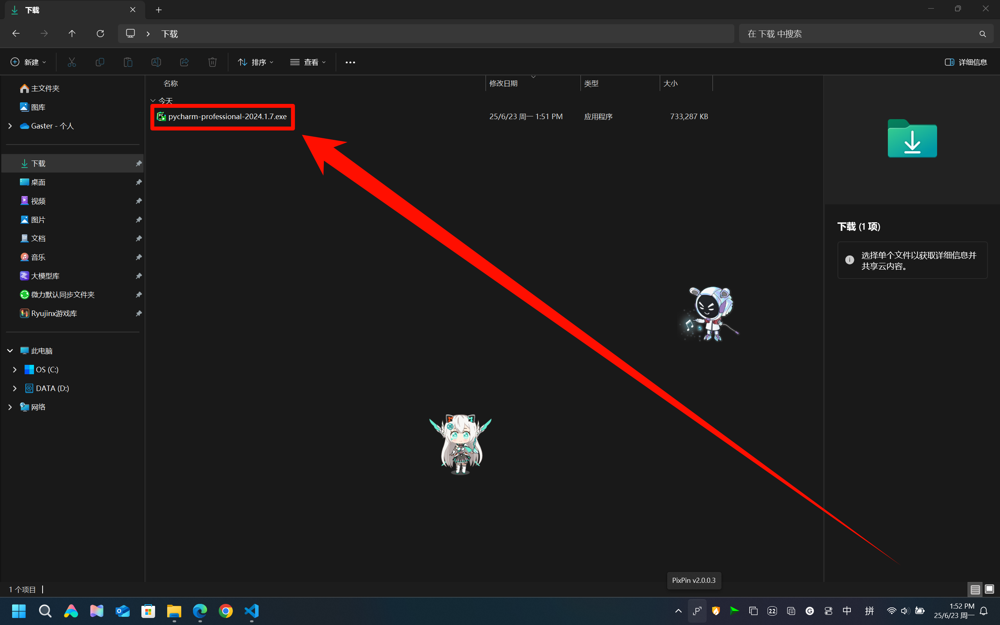
>
> 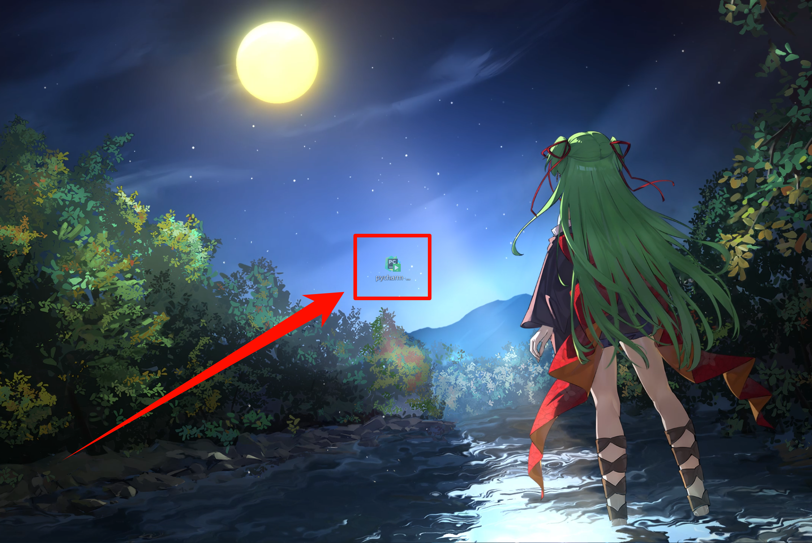

### 准备激活脚本

> - 首先下载`jetbrains激活码-Win系统.zip`
>
> 👉 [>>> 点击这里下载 <<<](https://enderg.lanzoum.com/i0aWN2ecyzle) 👈
>
> 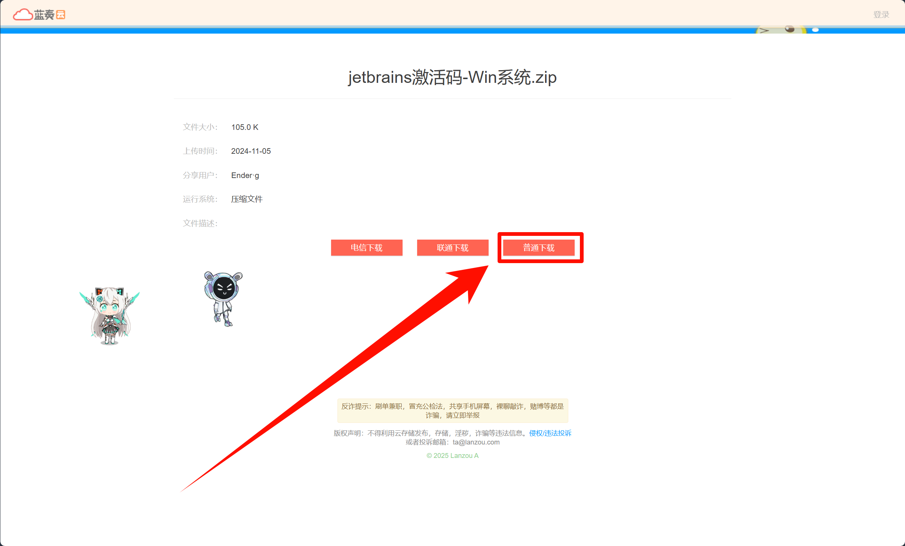
>
> - 来到你电脑的`下载`目录，将它移动到桌面，用于后续步骤
>
> 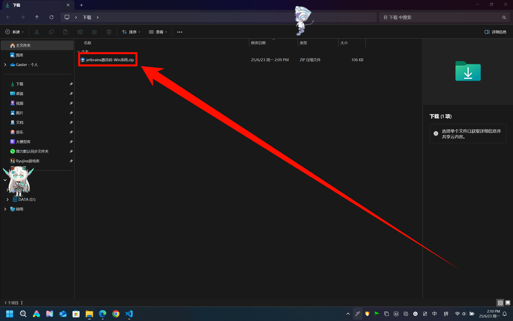
>
> 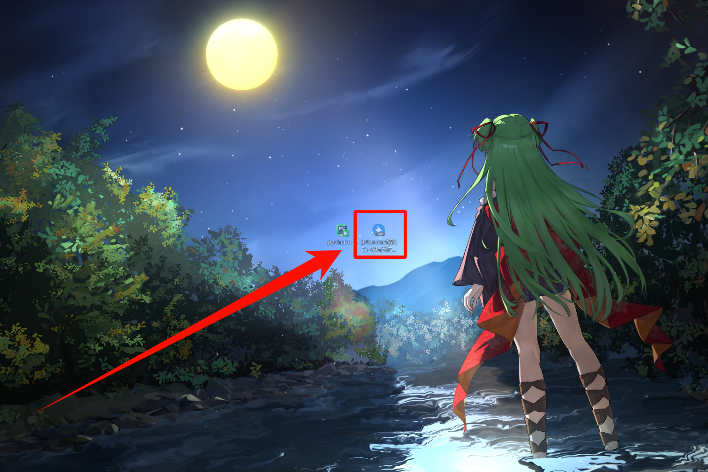

---

## 🔷 安装激活

### 运行`JetBrainsIDE安装包`

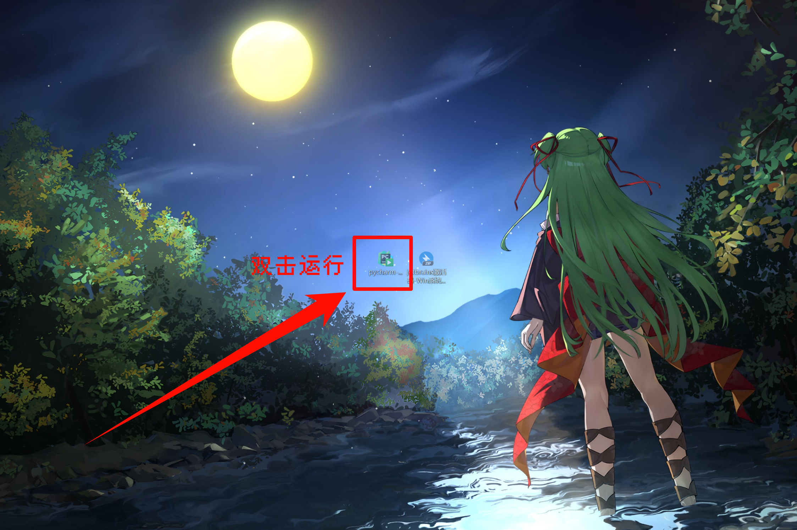

### 进入安装向导，前面选安照自己的习惯选择，等待安装完成

### 然后选择`否，我会在之后重新启动`

### 点击`完成`

### 然后先第一次打开你安装的JetBrainsIDE

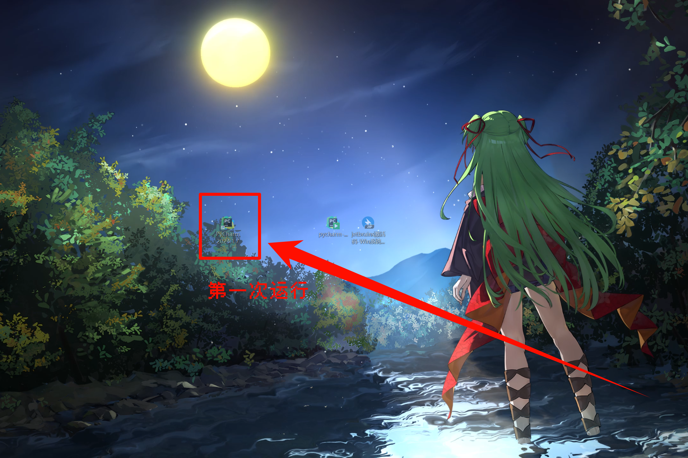

### 然后再退出，如果不做这步，后面脚本会无法识别到JetBrainsIDE

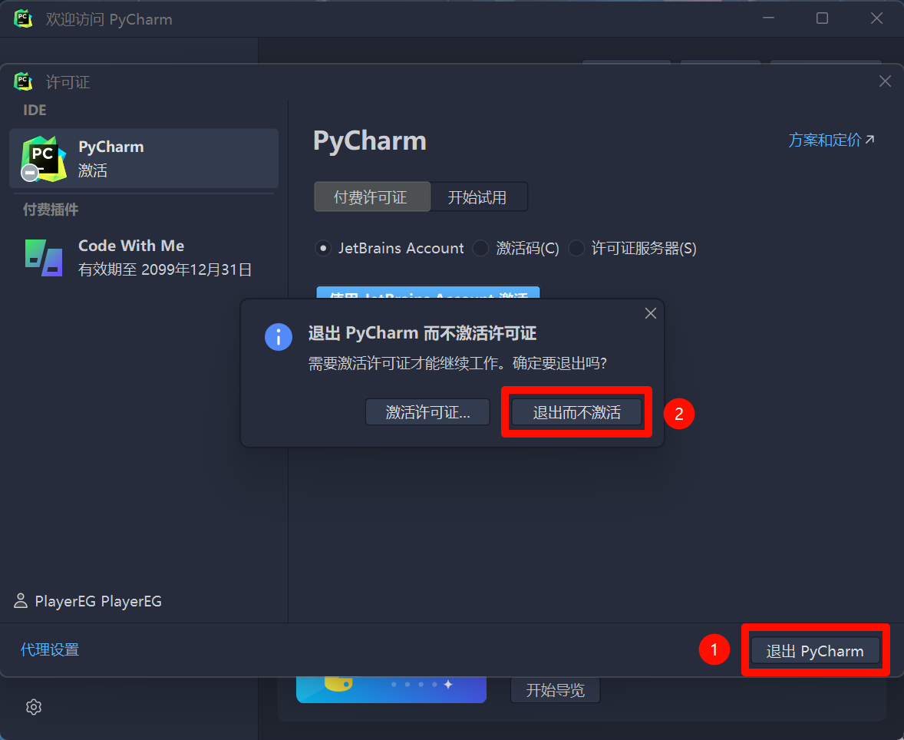

### 接着解压脚本压缩包，打开解压出来的文件夹

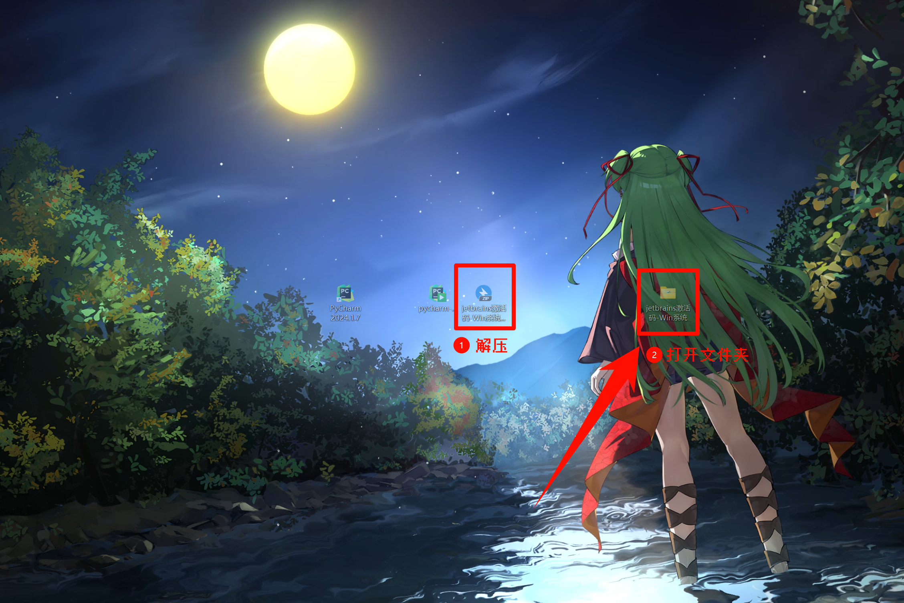

### 找到对应的`JetBrainsIDE`的激活脚本，双击运行

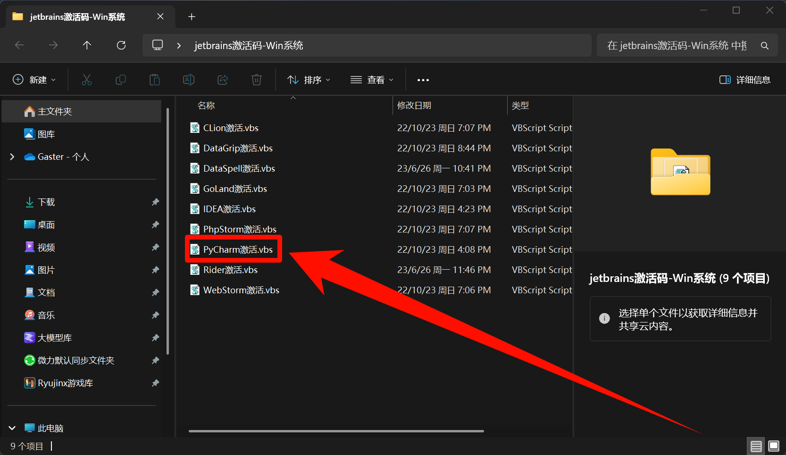

### 弹出这个窗口，说明激活成功，点击`确定`即可

---

## 🔷 验证

### 打开JetBrainsIDE查看，直接激活到了2099年12月31日

