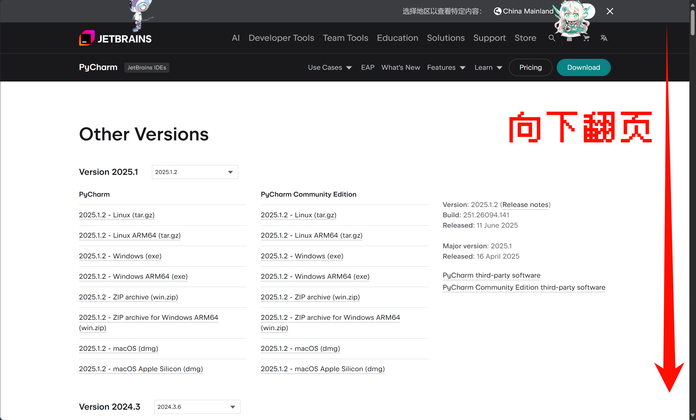
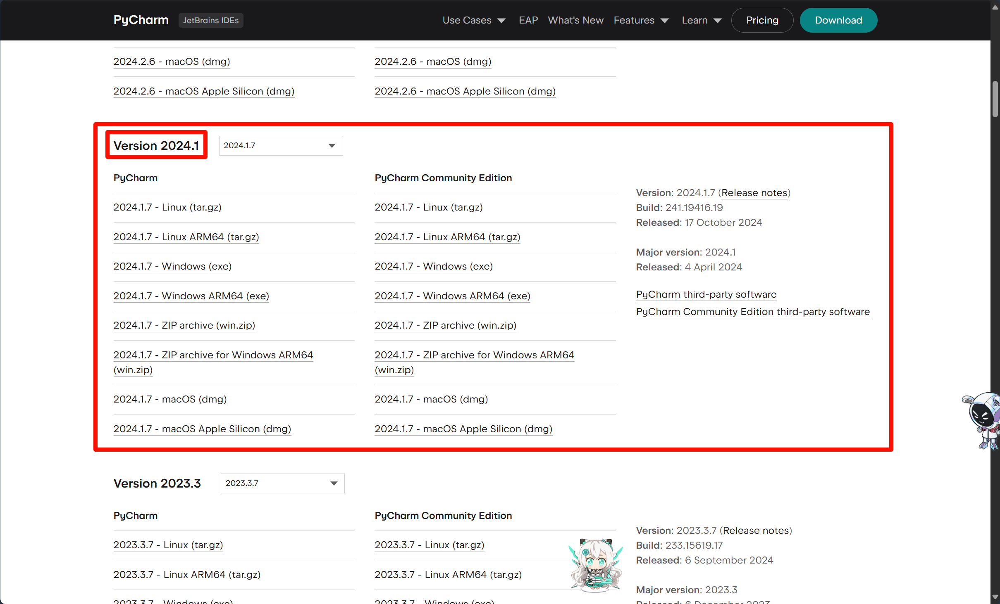
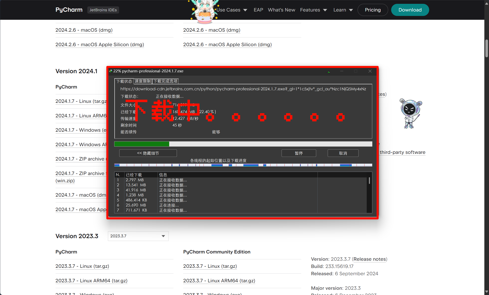
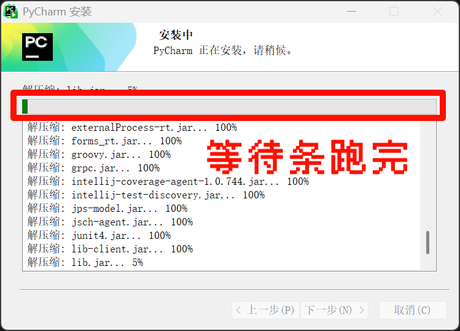
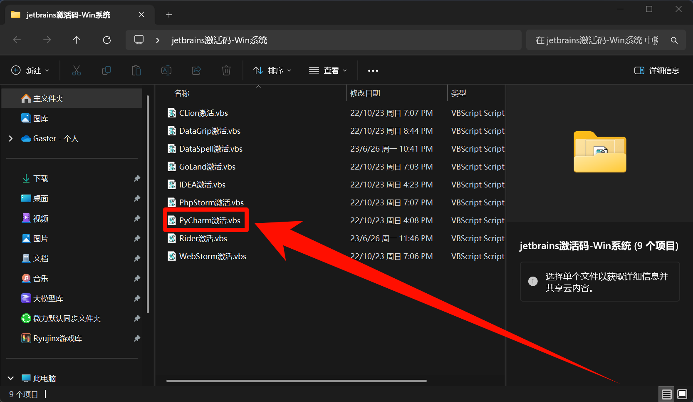

# JetBrains全家桶安装激活

## 教程概述

> 本教程将仅教学JetBrains全家桶安装加激活，用于后续教程作为工具使用。
>
>**Q:** 什么是JetBrains全家桶？
>
>**A:** JetBrains全家桶是由*JetBrains公司*提供的一套集成开发环境(IDE)和开发工具包，包括**IntelliJ IDEA、PyCharm、Rider、CLion、Goland、PhpStorm、WebStorm**等。

## 准备工作

### 1. 准备安装包(这里以PyCharm举例)

- 首先在浏览器上输入搜索`<对应的JetBrainsIDE名称> other version`

- 在搜索结果中找到`Other Versions - <对应的JetBrainsIDE名称> - JetBrains`，点进去

- 来到`Other Versions`页面，向下翻页，找到`Version 2024.1 - 2024.3`的区域

- 找到对应的IDE专业版的`Windows (exe)`安装包，点击下载

- 来到你电脑的`下载`目录，找到对应的IDE安装包，将它移动到桌面，用于后续步骤

### 2. 准备激活脚本

- 首先[`点击这里`](https://enderg.lanzoum.com/i0aWN2ecyzle)，下载激活脚本

- 来到你电脑的`下载`目录，将它移动到桌面，用于后续步骤

## 安装激活

- 运行`JetBrainsIDE安装包`，前面选安照自己的习惯选择，进入安装向导，等待安装完成，然后选择`否`，点击`完成`

- 然后先第一次打开你安装的JetBrainsIDE，然后再退出，如果不做这步，后面脚本会无法识别到JetBrainsIDE

- 接着解压脚本压缩包，打开解压出来的文件夹

- 找到对应的`JetBrainsIDE`的激活脚本，双击运行

- 弹出这个窗口，说明激活成功，点击`确定`即可

- 打开JetBrainsIDE查看，直接激活到了2099年12月31日

