# Python环境安装

## 教程概述

> 本教程将教学Python环境安装，用于后续教程使用。
>
> **Q:** 什么是Python环境？为什么经常使用Python作为教学语言？
>
> **A:** Python 是一种高级编程语言，由荷兰的*吉多·范罗苏姆*(也叫**龟叔**)于1990年代初设计，作为 ABC 语言的替代品。Python 提供了高效的高级数据结构，并支持简单有效的面向对象编程。其语法简洁明了，动态类型和解释型语言的特性使其成为编写脚本和快速开发应用的理想选择。用于编写各种软件，如**Web开发、数据处理、机器学习、游戏开发**等等。之所以使用Python作为教学语言是因为它的**简单易学，适合初学者学习，并且有很多第三方库，使得开发和教学更加方便，其易读性高。**

## 准备工作

### 1. 准备一台能开机的电脑

- 准备一台能开机的电脑，建议使用Windows系统，因为Python的安装包是针对Windows系统的。下面是我的能亮机的电脑

    

### 2. Python安装包

- 从[Python官网](https://www.python.org/downloads/)下载Python安装包

    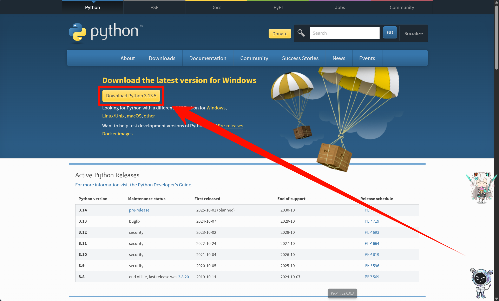

## 安装Python

- 双击安装包

    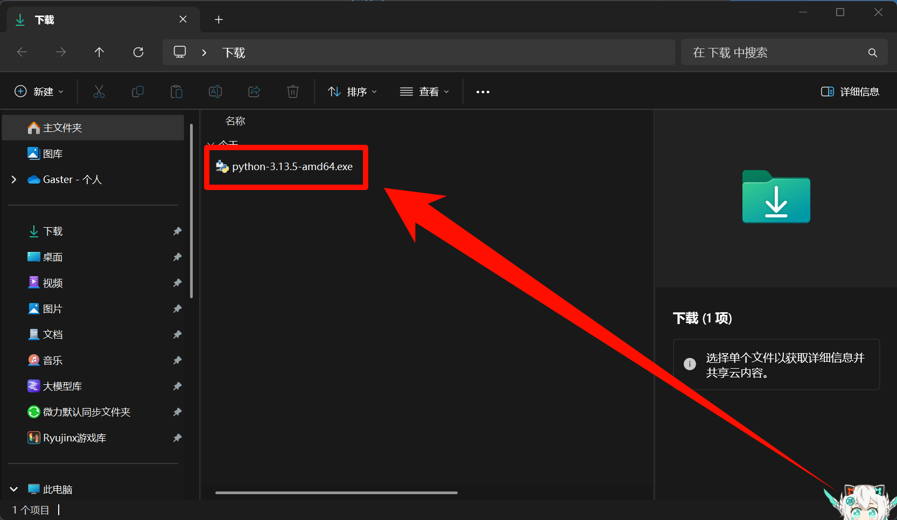

- 勾选上这两个复选框

    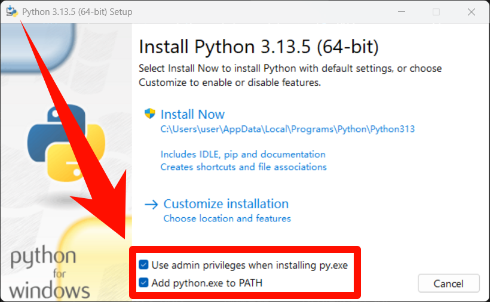

- 点击`Install Now`

    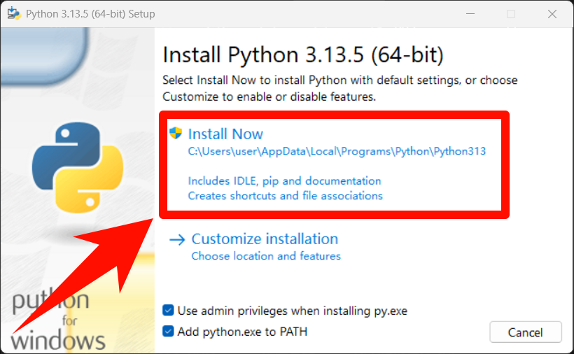

- 等待安装完成后，点击`Disable path length limit`

    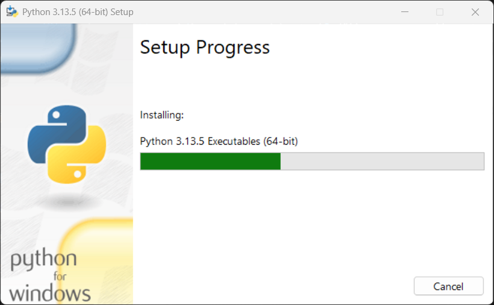

    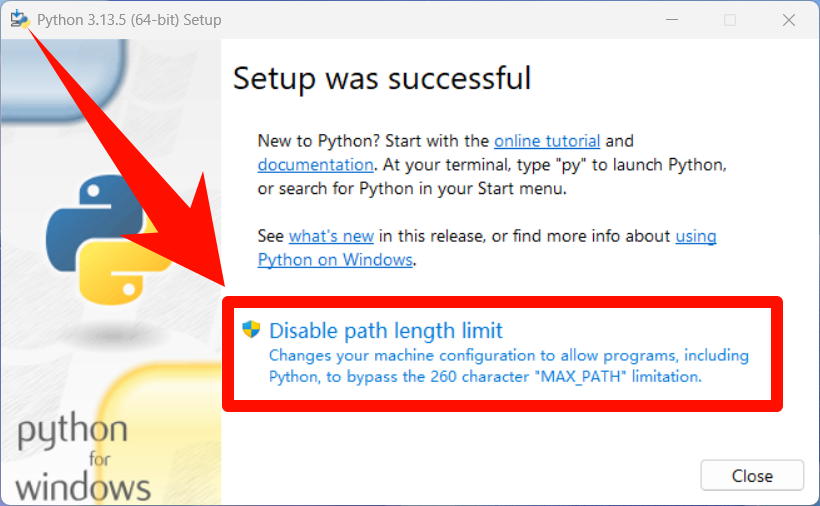

- 最后点击`Close`，Python就安装完成了

    

## 验证Python安装

- `Win+R`打开运行窗口，输入`wt`或者`cmd`，点击`确定`，打开终端

    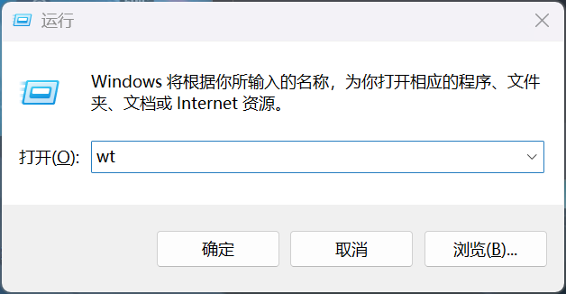

    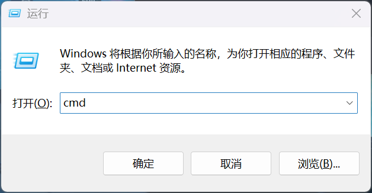

- 在终端中输入`python -V`

    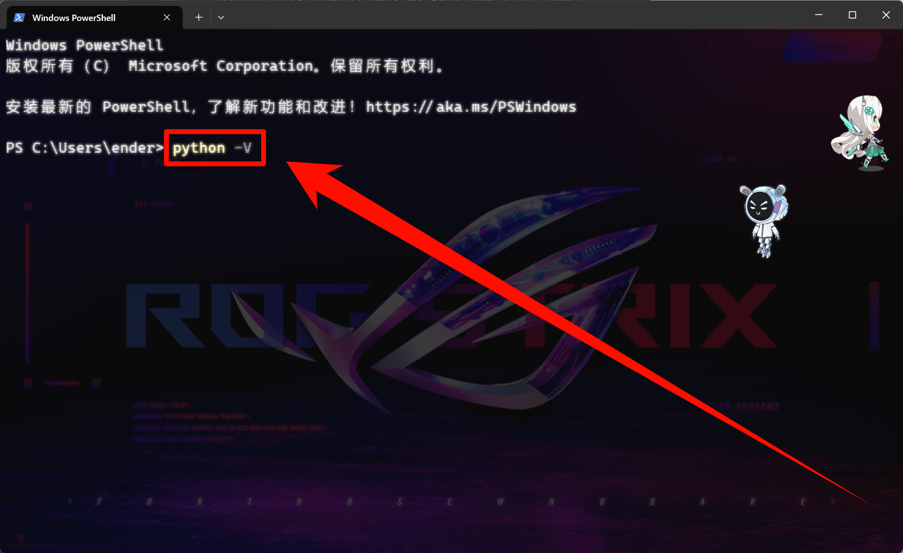

- 然后回车，出现python版本号，说明Python安装成功

    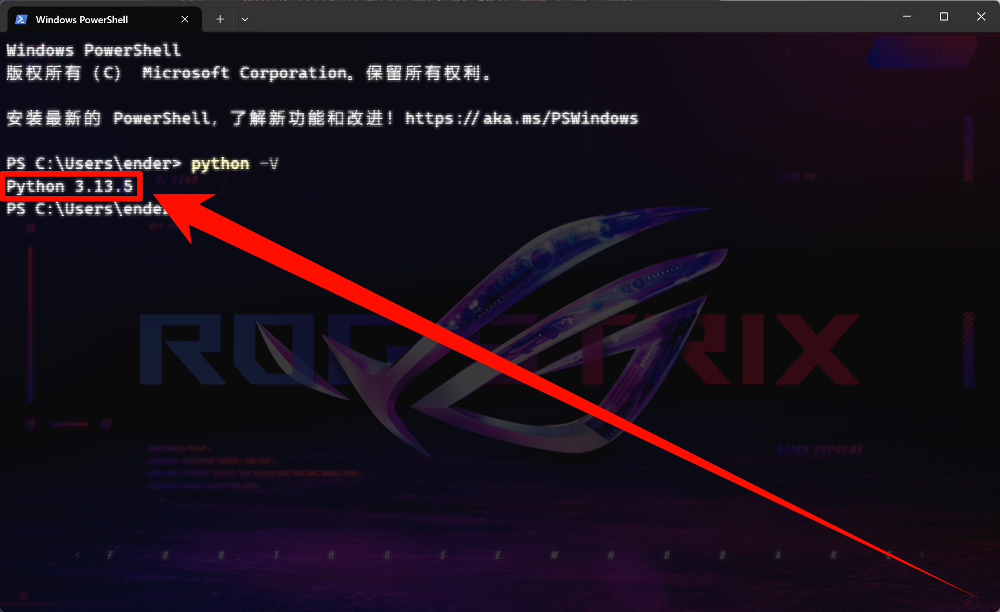

## Hello Python

- 在终端中输入`python`

    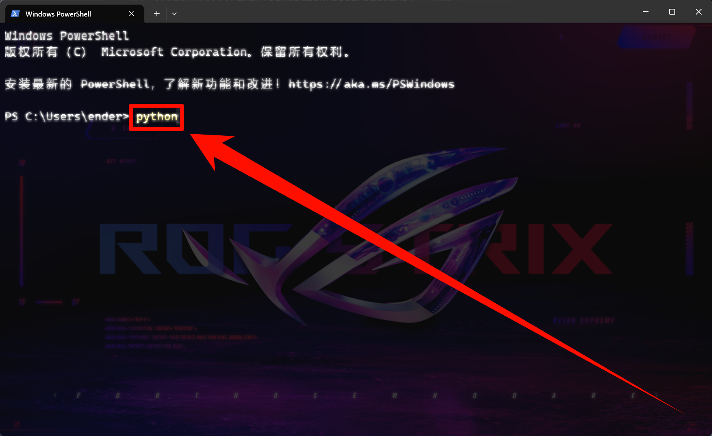

- 然后回车，出现Python解释器

    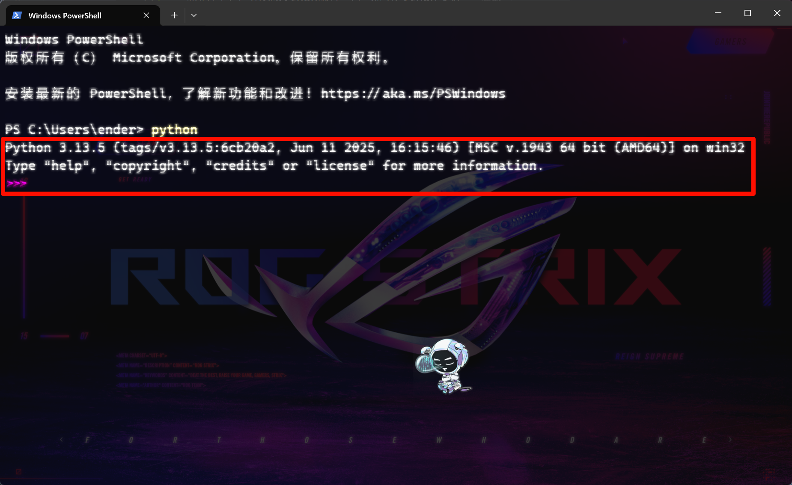

- 在Python解释器中输入`print("Hello Python")`

    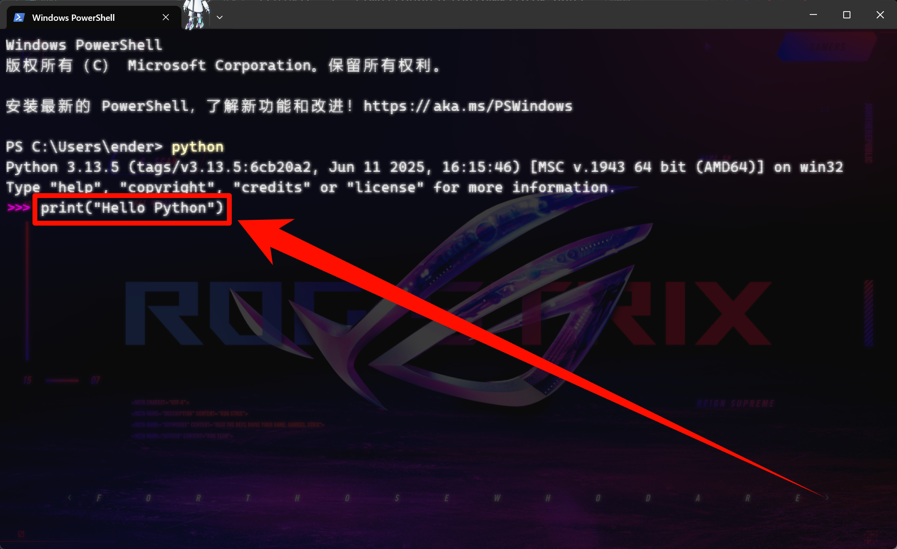

- 然后回车，解释器返回`Hello Python`

    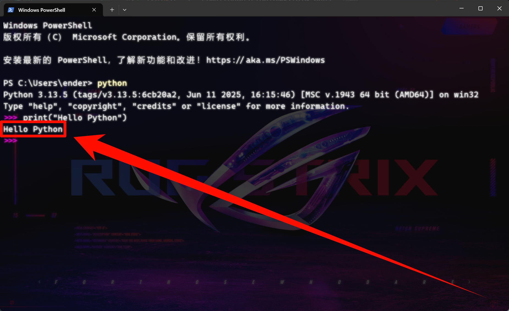
